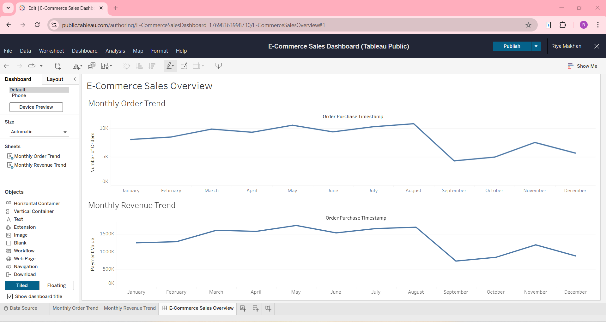

# E-Commerce Sales & Customer Analytics Platform

## Project Overview
This project analyzes real-world e-commerce data to generate business insights related to sales performance, customer behavior, and product trends.  
The objective is to support data-driven decision-making using structured analysis and visual reporting.

---

## Business Objectives
- Analyze overall sales and revenue trends
- Understand customer purchasing and repeat behavior
- Identify high-value customers using CLV
- Track churn and retention patterns
- Highlight top-performing products and regions

---

## Tools Used
- SQL (PostgreSQL / MySQL)
- Python (Pandas, NumPy)
- Excel
- Tableau
- GitHub

---

## Key KPIs Analyzed
- Total Revenue
- Monthly Revenue Growth
- Customer Lifetime Value (CLV)
- Repeat Purchase Rate
- Churn Rate
- Top Products
- Revenue by Region

---

## Dataset
- **Source:** Brazilian E-Commerce Public Dataset by Olist (Kaggle)
- Contains order, customer, product, payment, and review data

---

## Folder Structure
data/ → raw and processed datasets
sql/ → database schema and KPI queries
python/ → data cleaning and analysis
excel/ → reports
tableau/ → dashboard assets
reports/ → insights summary

---

## Key Insights
- Revenue is concentrated among a small segment of repeat customers
- Certain product categories consistently outperform others
- Monthly sales trends indicate seasonality in purchasing behavior
- High CLV customers contribute significantly to long-term revenue

---
---

## Tableau Dashboard Preview

The following dashboard was created using Tableau Public to visualize key sales and revenue trends.

Tableau Public Link: https://public.tableau.com/app/profile/riya.makhani/viz/E-CommerceSalesDashboard_17698363998730/E-CommerceSalesOverview

## How to Use This Project
1. Review SQL scripts to understand KPI calculations. SQL queries were developed and executed using MySQL Workbench.
2. Open Python notebooks for data cleaning and analysis
3. Explore Tableau dashboards for visual insights
4. Refer to the reports folder for summarized findings

---

## Author
**Riya Makhani**
